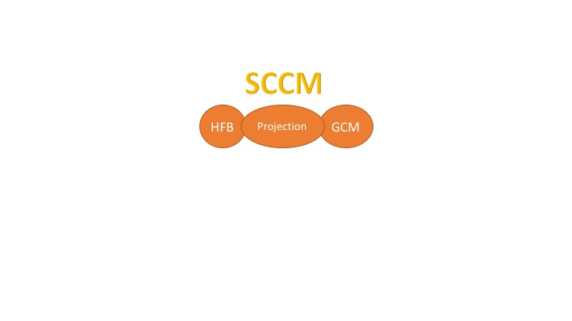

<figure style="float:right">
    
</figure>

# SCCM
Symmetry-Conserving-Configuration-Mixing Method for Nuclear Collective Excitations

This repository includes:
* source codes for HFB, Projection on angular momentum and particle numbers and configuration mixing calcualtions
* some popular shell-model interactions
* files for valence spaces

How to download the code?
* install <a href='https://git-scm.com/book/en/v2/Getting-Started-Installing-Git'>git</a>
* git clone https://github.com/jmyao17/SCCM.git

If you are not familar with git, here is a nice git tutorial <a href='https://www.youtube.com/watch?v=mVnZVw4KJnc'>[YouTube]</a>.

How to use the code?
* shell script file .sh or python script file is available for use

More details about the features and variables of the code will be published somewhere.

To be implemented ...
* lib directory is not included yet

MIT License

Copyright (c) 2018 Jiangming Yao

Permission is hereby granted, free of charge, to any person obtaining a copy
of this software and associated documentation files (the "Software"), to deal
in the Software without restriction, including without limitation the rights
to use, copy, modify, merge, publish, distribute, sublicense, and/or sell
copies of the Software, and to permit persons to whom the Software is
furnished to do so, subject to the following conditions:

The above copyright notice and this permission notice shall be included in all
copies or substantial portions of the Software.

THE SOFTWARE IS PROVIDED "AS IS", WITHOUT WARRANTY OF ANY KIND, EXPRESS OR
IMPLIED, INCLUDING BUT NOT LIMITED TO THE WARRANTIES OF MERCHANTABILITY,
FITNESS FOR A PARTICULAR PURPOSE AND NONINFRINGEMENT. IN NO EVENT SHALL THE
AUTHORS OR COPYRIGHT HOLDERS BE LIABLE FOR ANY CLAIM, DAMAGES OR OTHER
LIABILITY, WHETHER IN AN ACTION OF CONTRACT, TORT OR OTHERWISE, ARISING FROM,
OUT OF OR IN CONNECTION WITH THE SOFTWARE OR THE USE OR OTHER DEALINGS IN THE
SOFTWARE.

